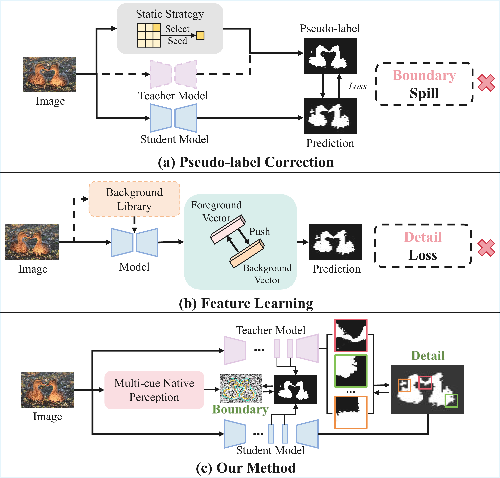
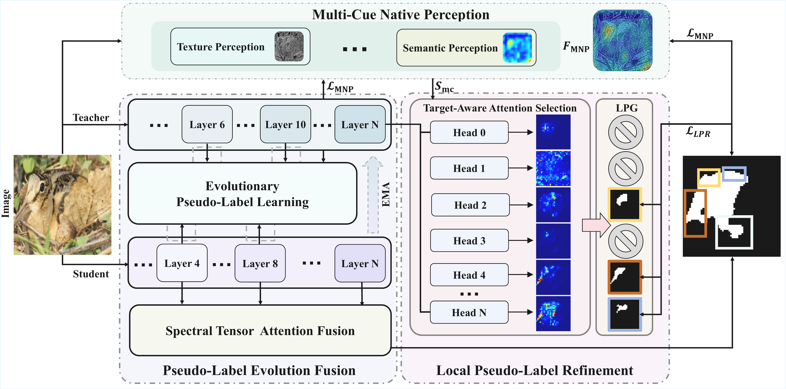
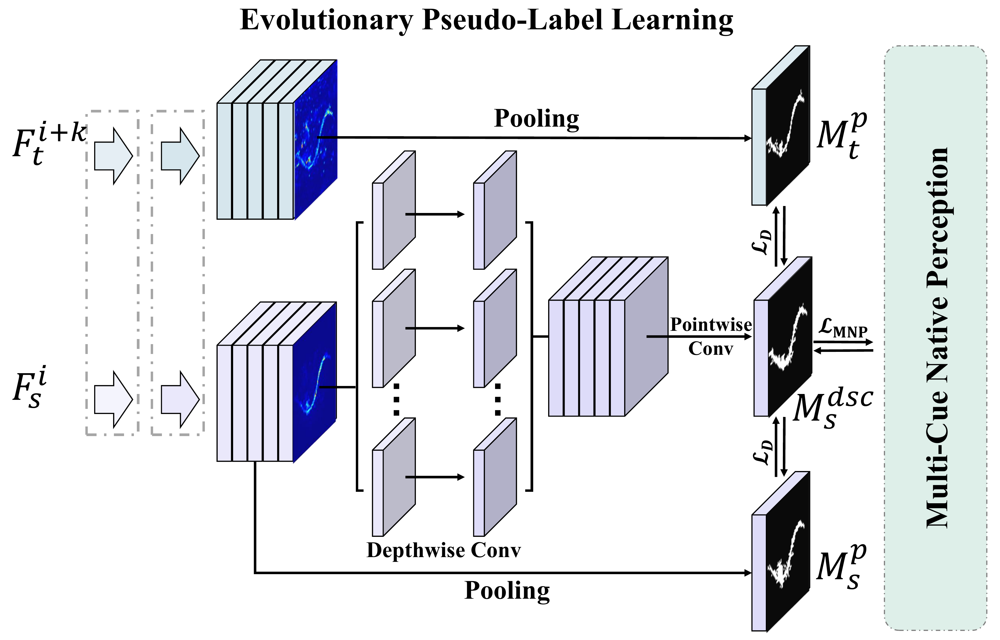
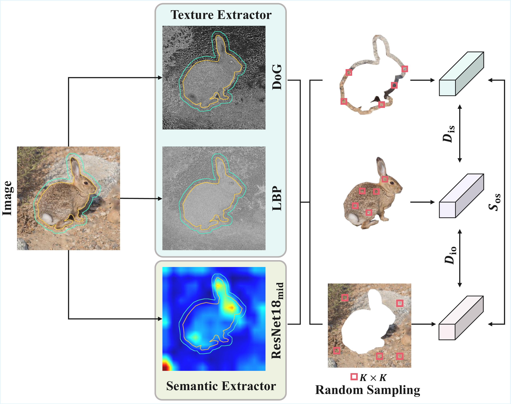
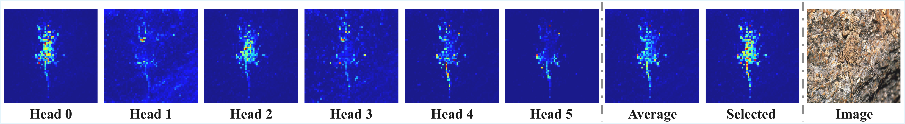

# EReCu

**EReCu: Pseudo-Label Evolution Fusion and Refinement with Multi-Cue Learning for Unsupervised Camouflage Detection**


## Method Overview

### UCOD paradigm comparison / Overall Framework of EReCu

<p align="center">
  
  
</p>

### Evolutionary Pseudo-Label Learning / Multi-Cue Native Perception

<p align="center">
  
  
</p>

### Visualization of MHSA reveals that different heads focus on distinct visual cues

<p align="center">
  
</p>

## Repository Structure

```text
EReCu/
├── assets/figures/                  # Figures
├── configs/erecu.yaml               # Configuration
├── erecu/                           # Core implementation
├── tools/check_data.py              # Dataset checker
├── bootstrap_dependencies.py        # Dependency installer
├── train.py                         # Training
├── infer.py                         # Inference
├── evaluate.py                      # Evaluation
└── run.py                           # Unified entry point
```

## Environment Setup

The following example uses Python 3.10, PyTorch 2.4.1, and CUDA 12.1. Select a PyTorch CUDA build compatible with the NVIDIA driver installed on your server.

We recommend using a GPU with **at least 32 GB of memory** for training and inference. GPUs with larger memory capacity may be required depending on the batch size and experimental settings.

```bash
conda create -n erecu python=3.10 -y
conda activate erecu

python -m pip install torch==2.4.1 torchvision==0.19.1 \
  --index-url https://download.pytorch.org/whl/cu121

python bootstrap_dependencies.py
```

`bootstrap_dependencies.py` checks and installs missing packages through `python -m pip` in the currently activated environment.

## Pretrained Backbone

Download the pretrained DINO ViT-S/8 weights from the [official DINO release](https://dl.fbaipublicfiles.com/dino/dino_deitsmall8_pretrain/dino_deitsmall8_pretrain.pth) and place the file at:

```text
weights/dino_deitsmall8_pretrain.pth
```

From the repository root, download it directly to the expected location with:

```bash
mkdir -p weights
wget -O weights/dino_deitsmall8_pretrain.pth \
  https://dl.fbaipublicfiles.com/dino/dino_deitsmall8_pretrain/dino_deitsmall8_pretrain.pth
```

The checkpoint size is approximately **82.71 MB**.


### Dataset Downloads


- **CAMO-Train and COD10K-Train:**  
  [Google Drive](https://drive.google.com/file/d/1D9bf1KeeCJsxxri6d2qAC7z6O1X_fxpt/view?usp=sharing)

- **CAMO, CHAMELEON, and COD10K test sets:**  
  [Google Drive](https://drive.google.com/file/d/1QEGnP9O7HbN_2tH999O3HRIsErIVYalx/view?usp=sharing)

- **NC4K test set:**  
  [Google Drive](https://drive.google.com/file/d/1kzpX_U3gbgO9MuwZIWTuRVpiB7V6yrAQ/view?usp=sharing)

The download links for the training set and the CAMO, CHAMELEON, and COD10K test sets are adopted from the [DengPingFan/SINet](https://github.com/DengPingFan/SINet/) repository. The NC4K download link is adopted from the [JingZhang617/COD-Rank-Localize-and-Segment](https://github.com/JingZhang617/COD-Rank-Localize-and-Segment) repository.

## Dataset Preparation

Organize the datasets as follows:

```text
data/
├── TrainDataset/
│   └── Imgs/                        # 4,040 training images
│                                    # CAMO-Train: 1,000
│                                    # COD10K-Train: 3,040
└── TestDataset/
    ├── CAMO/
    │   ├── Imgs/
    │   └── GT/                      # 250 samples
    ├── CHAMELEON/
    │   ├── Imgs/
    │   └── GT/                      # 76 samples
    ├── COD10K/
    │   ├── Imgs/
    │   └── GT/                      # 2,026 samples
    └── NC4K/
        ├── Imgs/
        └── GT/                      # 4,121 samples
```

Within each test dataset, every image in `Imgs/` must have a corresponding ground-truth mask in `GT/` with the same filename stem. Image and mask extensions may differ.


Before training, verify the dataset structure, sample counts, and image-mask correspondence:

```bash
python run.py check --data-root data
```


## Training and Testing

### Complete Pipeline

Run dataset checking, training, inference, and evaluation sequentially:

```bash
python run.py all --data-root data
```


### Single-GPU Example

Run the complete pipeline on GPU 7:

```bash
CUDA_VISIBLE_DEVICES=7 python run.py all --data-root data
```

### Only Training

Train EReCu using the unlabeled images in `data/TrainDataset/Imgs`:

```bash
python run.py train --data-root data
```

### Only Testing

Run inference and evaluation on CAMO, CHAMELEON, COD10K, and NC4K:


```bash
python run.py test --data-root data
```

### Testing Selected Datasets

The `--datasets` option restricts inference and evaluation to the specified benchmarks. Valid identifiers are `CAMO`, `CHAMELEON`, `COD10K`, and `NC4K`.

For example, to evaluate only CAMO and CHAMELEON with a particular checkpoint:

```bash
python run.py test \
  --data-root data \
  --datasets CAMO CHAMELEON \
  --checkpoint outputs/erecu/checkpoint_epoch_010.pth \
  --output outputs/eval_epoch_010_camo_chameleon
```

To evaluate a single benchmark:

```bash
python run.py test \
  --data-root data \
  --datasets NC4K \
  --checkpoint outputs/erecu/checkpoint_best.pth \
  --output outputs/eval_best_nc4k
```

Each selected dataset receives an independent prediction directory and JSON metric file under the specified output root. The aggregate file `benchmark/metrics_summary.json` contains only the datasets requested in that invocation. Omitting `--datasets` restores the default behavior of evaluating all four benchmarks.


## Output Structure

Checkpoints, predictions, and evaluation results are saved under:

```text
outputs/erecu/
```

The aggregated benchmark results are written to:

```text
outputs/erecu/benchmark/metrics_summary.json
```

A typical output structure is:

```text
outputs/erecu/
├── checkpoint_epoch_001.pth
├── checkpoint_epoch_002.pth
├── checkpoint_best.pth
├── checkpoint_best.json
└── benchmark/
    ├── predictions/
    │   ├── CAMO/
    │   ├── CHAMELEON/
    │   ├── COD10K/
    │   └── NC4K/
    ├── metrics/
    │   ├── CAMO.json
    │   ├── CHAMELEON.json
    │   ├── COD10K.json
    │   └── NC4K.json
    └── metrics_summary.json
```

## Citation

If you find EReCu useful for your research, please cite our paper:

```bibtex
@InProceedings{EReCu_2026_CVPR,
    author    = {Jiang, Shuo and Zhang, Gaojia and Tan, Min and Yin, Yufei and Pan, Gang},
    title     = {{EReCu}: Pseudo-Label Evolution Fusion and Refinement with Multi-Cue Learning for Unsupervised Camouflage Detection},
    booktitle = {Proceedings of the IEEE/CVF Conference on Computer Vision and Pattern Recognition (CVPR)},
    month     = {June},
    year      = {2026},
    pages     = {25547--25556}
}
```
